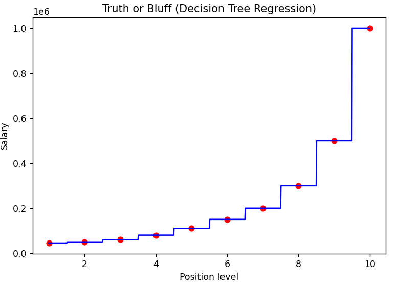
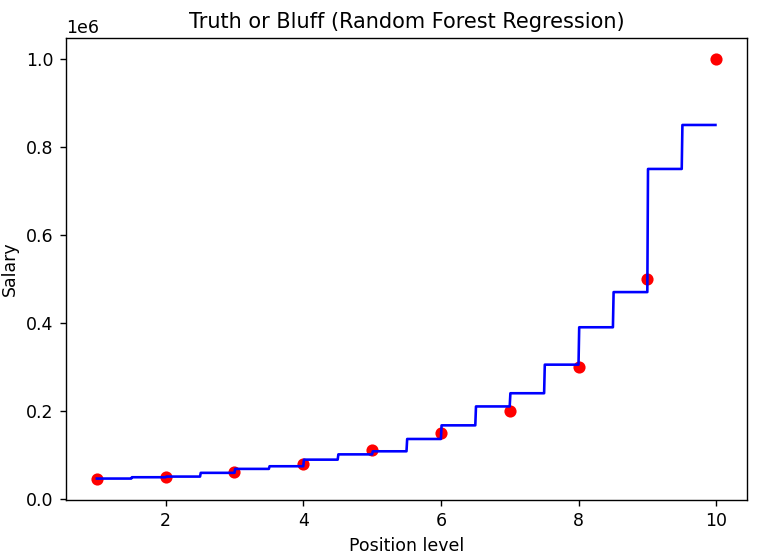
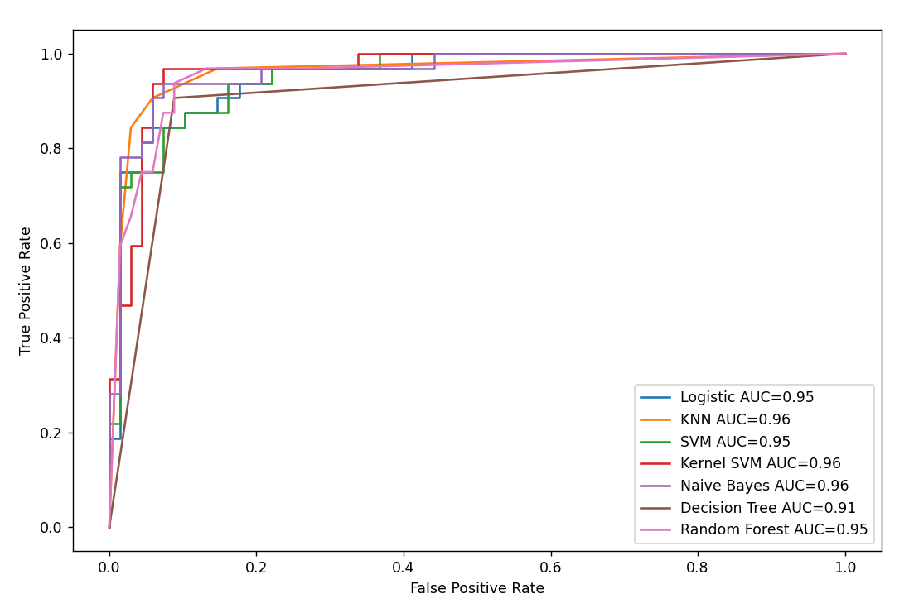

# Machine Learning With Python

> 自學 Python 、Machine Learning，並紀錄程式碼筆記

以 Python 實現機器學習。資料篩選、建構模型、預測結果、模型驗證、視覺化。

參考課程：[Machine Learning A-Z™: Python & R in Data Science [2023]](https://www.udemy.com/course/machinelearning/)

- **Regression 迴歸**
  - [簡單線性迴歸](#簡單線性迴歸Simple-Linear-Regression)
  - [複迴歸](#複迴歸Multiple-Linear-Regression)
  - [多項式迴歸](#多項式迴歸Polynomial-Regression)
  - [支持向量迴歸](#支持向量迴歸SVR)
  - [決策樹迴歸](#決策樹迴歸Decision-Tree-Regression)
  - [隨機森林迴歸](#隨機森林迴歸Random-Forest-Regression)
- **Classification 分類**
  - [羅吉斯迴歸](#羅吉斯迴歸Logistic-Regression)
  - [K-近鄰演算法](#K-近鄰演算法KNN)
  - [支援向量機](#支援向量機SVM)
  - [非線性支援向量機](#非線性支援向量機Kernel-SVM)
  - [樸素貝氏分類器](#樸素貝氏分類器Native-Bayes)
  - [決策樹](#決策樹Decision-Tree)
  - [隨機森林](#隨機森林Random-Forest)
- **Clurtering 分群**

  - [K-平均演算法](#K-平均演算法K-means-Clustering)
  - [階層式分群法](#階層式分群法Hierarchical-Clustering)

- [模型驗證](#模型驗證)
  - [迴歸模型指標](#迴歸模型指標)
  - [分類模型指標](#分類模型指標)
  - [ROC 曲線](#ROC曲線)

## 資料前處理

- #### 資料輸入

```python
import pandas as pd

# 輸入資料
dataset = pd.read_csv('data/Salary_Data.csv')

# 定義反應變數、解釋變數
X = dataset.iloc[:, :-1].values
Y = dataset.iloc[:, -1].values
```

- #### 類別資料轉換

```python
from sklearn.preprocessing import OneHotEncoder
from sklearn.compose import ColumnTransformer

ct = ColumnTransformer(
    transformers=[('encoder', OneHotEncoder(), [3])], remainder='passthrough')
X = np.array(ct.fit_transform(X))
print(X)
```

- #### 特徵縮放

```python
from sklearn.preprocessing import StandardScaler

sc = StandardScaler()
X_train = sc.fit_transform(X_train)
X_test = sc.transform(X_test)
```

- #### 資料切割

```python
from sklearn.model_selection import train_test_split

x_train, x_test, y_train, y_test = train_test_split(
    X, Y, test_size=1/3, random_state=0)
```

## Regression

### 簡單線性迴歸（Simple Linear Regression）

- 建立模型

```python
from sklearn.linear_model import LinearRegression

# 訓練模型
regressor = LinearRegression()
regressor.fit(x_train, y_train)

# 預測結果
y_pred = regressor.predict(x_test)
```

- 模型驗證
  參照 [迴歸模型指標](#迴歸模型指標)。


### 複迴歸（Multiple Linear Regression）

- 建立模型

```python
from sklearn.linear_model import LinearRegression

# 訓練模型
regressor = LinearRegression()
regressor.fit(x_train, y_train)

# 預測結果
y_pred = regressor.predict(x_test)
```

- 模型驗證
  參照 [迴歸模型指標](#迴歸模型指標)。


### 多項式迴歸（Polynomial Regression）

- 建立模型

```python
from sklearn.preprocessing import PolynomialFeatures
from sklearn.linear_model import LinearRegression

# 訓練模型
poly_reg = PolynomialFeatures(degree=4)
X_poly = poly_reg.fit_transform(X)
lin_reg_2 = LinearRegression()
lin_reg_2.fit(X_poly, Y)

# 預測結果
lin_reg_2.predict(poly_reg.fit_transform([[6.5]]))
```

- 模型驗證

```python
from sklearn.metrics import r2_score

# 以 R squared、MAPE 驗證模型
def mape(y_true, y_pred):
    Accuracy = r2_score(y_true, y_pred)*100
    Mape = np.mean(np.abs((y_true - y_pred) / y_true)) * 100
    print(" Accuracy of the model is %.2f" % Accuracy)
    print(" MAPE of the model is %.2f" % Mape)


mape(Y, lin_reg_2.predict(poly_reg.fit_transform(X)))

```


### 支持向量迴歸（SVR）

- 特徵縮放

```python
from sklearn.preprocessing import StandardScaler

sc_X = StandardScaler()
sc_y = StandardScaler()
X = sc_X.fit_transform(X)
y = sc_y.fit_transform(y)
```

- 建立模型

```python
from sklearn.svm import SVR

# 訓練模型
regressor = SVR(kernel='rbf')
regressor.fit(X, y)

# 預測結果
sc_y.inverse_transform(
    regressor.predict(X).reshape(-1, 1))
```

- 模型驗證
  參照 [迴歸模型指標](#迴歸模型指標)。


### 決策樹迴歸（Decision Tree Regression）

- 建立模型

```python
from sklearn.tree import DecisionTreeRegressor

# 訓練模型
regressor = DecisionTreeRegressor(random_state=0)
regressor.fit(X, y)

# 預測結果
regressor.predict(X)
```

- 模型驗證
  參照 [迴歸模型指標](#迴歸模型指標)。



### 隨機森林迴歸（Random Forest Regression）

- 建立模型

```python
from sklearn.ensemble import RandomForestRegressor

# 訓練模型
regressor = RandomForestRegressor(n_estimators=10, random_state=0)
regressor.fit(X, y)

# 預測結果
regressor.predict(X)
```

- 模型驗證
  參照 [迴歸模型指標](#迴歸模型指標)。



## Classification

### 羅吉斯迴歸（Logistic Regression）

- 特徵縮放
  參考[特徵縮放](#特徵縮放)。

- 建立模型

```python
from sklearn.linear_model import LogisticRegression

# 訓練模型
classifier = LogisticRegression(random_state=0)
classifier.fit(X_train, y_train)

# 預測結果
y_pred = classifier.predict(X_test)
```

- 模型驗證
  參照 [分類模型指標](#分類模型指標)。


### K-近鄰演算法（KNN）

- 特徵縮放
  參考[特徵縮放](#特徵縮放)。

- 建立模型

```python
from sklearn.neighbors import KNeighborsClassifier

# 訓練模型
classifier = KNeighborsClassifier(n_neighbors=5, metric='minkowski', p=2)
classifier.fit(X_train, y_train)

# 預測結果
y_pred = classifier.predict(X_test)
```

- 模型驗證
  參照 [分類模型指標](#分類模型指標)。


### 支援向量機（SVM）

- 特徵縮放
  參考[特徵縮放](#特徵縮放)。

- 建立模型

```python
from sklearn.svm import SVC

# 訓練模型
classifier = SVC(kernel='linear', random_state=0)
classifier.fit(X_train, y_train)

# 預測結果
y_pred = classifier.predict(X_test)
```

- 模型驗證
  參照 [分類模型指標](#分類模型指標)。


### 非線性支援向量機（Kernel SVM）

- 特徵縮放
  參考[特徵縮放](#特徵縮放)。

- 建立模型

```python
from sklearn.svm import SVC

# 訓練模型
classifier = SVC(kernel='rbf', random_state=0)
classifier.fit(X_train, y_train)

# 預測結果
y_pred = classifier.predict(X_test)
```

- 模型驗證
  參照 [分類模型指標](#分類模型指標)。


### 樸素貝氏分類器（Native Bayes）

- 特徵縮放
  參考[特徵縮放](#特徵縮放)。

- 建立模型

```python
from sklearn.naive_bayes import GaussianNB

# 訓練模型
classifier = GaussianNB()
classifier.fit(X_train, y_train)

# 預測結果
y_pred = classifier.predict(X_test)
```

- 模型驗證
  參照 [分類模型指標](#分類模型指標)。


### 決策樹（Decision Tree）

- 特徵縮放
  參考[特徵縮放](#特徵縮放)。

- 建立模型

```python
from sklearn.tree import DecisionTreeClassifier

# 訓練模型
classifier = DecisionTreeClassifier(criterion='entropy', random_state=0)
classifier.fit(X_train, y_train)

# 預測結果
y_pred = classifier.predict(X_test)
```

- 模型驗證
  參照 [分類模型指標](#分類模型指標)。


### 隨機森林（Random Forest）

- 特徵縮放
  參考[特徵縮放](#特徵縮放)。

- 建立模型

```python
from sklearn.ensemble import RandomForestClassifier

# 訓練模型
classifier = RandomForestClassifier(
    n_estimators=10, criterion='entropy', random_state=0)
classifier.fit(X_train, y_train)

# 預測結果
y_pred = classifier.predict(X_test)
```

- 模型驗證
  參照 [分類模型指標](#分類模型指標)。


## Clurtering

### K-平均演算法（K means Clustering）

- 決定分群數

以 elbow method 找到合適的分群數

```python
from sklearn.cluster import KMeans
import matplotlib.pyplot as plt

wcss = []
for i in range(1, 11):
    kmeans = KMeans(n_clusters = i, init = 'k-means++', random_state = 42)
    kmeans.fit(X)
    wcss.append(kmeans.inertia_)
plt.plot(range(1, 11), wcss)
plt.title('The Elbow Method')
plt.xlabel('Number of clusters')
plt.ylabel('WCSS')
plt.show()
```


- 建立模型

```python
from sklearn.cluster import KMeans

# 訓練模型
kmeans = KMeans(n_clusters = 5, init = 'k-means++', random_state = 42)
y_kmeans = kmeans.fit_predict(X)
```


### 階層式分群法（Hierarchical Clustering）

- 決定分群數

以樹狀圖決定合適的分群數

```python
import scipy.cluster.hierarchy as sch
from sklearn.cluster import AgglomerativeClustering
import matplotlib.pyplot as plt

dendrogram = sch.dendrogram(sch.linkage(X, method = 'ward'))
plt.title('Dendrogram')
plt.xlabel('Customers')
plt.ylabel('Euclidean distances')
plt.show()
```


- 建立模型

```python
from sklearn.cluster import AgglomerativeClustering

# 訓練模型
hc = AgglomerativeClustering(n_clusters = 5, affinity = 'euclidean', linkage = 'ward')
y_hc = hc.fit_predict(X)
```


## 模型驗證

- ### 迴歸模型指標

```python
from sklearn.metrics import r2_score

# 以 R squared、MAPE 驗證模型
def mape(y_true, y_pred):
    Accuracy = r2_score(y_true, y_pred)*100
    Mape = np.mean(np.abs((y_true - y_pred) / y_true)) * 100
    print(" Accuracy of the model is %.2f" % Accuracy)
    print(" MAPE of the model is %.2f" % Mape)


mape(y_test, y_pred)

```

- ### 分類模型指標

```python
from sklearn.metrics import confusion_matrix, accuracy_score, classification_report

# Making the Confusion Matrix / Accuracy / Report

cm = confusion_matrix(y_test, y_pred)
print(cm)
print("Accuracy of the model is %.2f" % accuracy_score(y_test, y_pred))
print(classification_report(y_test, y_pred))
```

- ### ROC 曲線

計算各模型的 FPR、TPR。

```python
from sklearn import metrics

# logistic define metrics
y_pred_logistic_proba = logistic_classifier.predict_proba(X_test)[::, 1]
logistic_fpr, logistic_tpr, _ = metrics.roc_curve(
    y_test,  y_pred_logistic_proba)
logistic_auc = metrics.roc_auc_score(y_test, y_pred_logistic_proba)

# KNN define metrics
y_pred_knn_proba = knn_classifier.predict_proba(X_test)[::, 1]
knn_fpr, knn_tpr, _ = metrics.roc_curve(
    y_test,  y_pred_knn_proba)
knn_auc = metrics.roc_auc_score(y_test, y_pred_knn_proba)

# SVM define metrics
y_pred_svm_proba = svm_classifier.predict_proba(X_test)[::, 1]
svm_fpr, svm_tpr, _ = metrics.roc_curve(
    y_test,  y_pred_svm_proba)
svm_auc = metrics.roc_auc_score(y_test, y_pred_svm_proba)

# Kernel SVM define metrics
y_pred_kernelsvm_proba = kernelsvm_classifier.predict_proba(X_test)[::, 1]
kernelsvm_fpr, kernelsvm_tpr, _ = metrics.roc_curve(
    y_test,  y_pred_kernelsvm_proba)
kernelsvm_auc = metrics.roc_auc_score(y_test, y_pred_kernelsvm_proba)

# NB define metrics
y_pred_nb_proba = nb_classifier.predict_proba(X_test)[::, 1]
nb_fpr, nb_tpr, _ = metrics.roc_curve(
    y_test,  y_pred_nb_proba)
nb_auc = metrics.roc_auc_score(y_test, y_pred_nb_proba)

# DC define metrics
y_pred_dc_proba = dc_classifier.predict_proba(X_test)[::, 1]
dc_fpr, dc_tpr, _ = metrics.roc_curve(
    y_test,  y_pred_dc_proba)
dc_auc = metrics.roc_auc_score(y_test, y_pred_dc_proba)

# RF define metrics
y_pred_rf_proba = rf_classifier.predict_proba(X_test)[::, 1]
rf_fpr, rf_tpr, _ = metrics.roc_curve(
    y_test,  y_pred_rf_proba)
rf_auc = metrics.roc_auc_score(y_test, y_pred_rf_proba)
```

- 繪製圖形

```python
import matplotlib.pyplot as plt

plt.plot(logistic_fpr, logistic_tpr,
         label="Logistic AUC=" + str(round(logistic_auc, 2)))
plt.plot(knn_fpr, knn_tpr, label="KNN AUC=" + str(round(knn_auc, 2)))
plt.plot(svm_fpr, svm_tpr, label="SVM AUC=" + str(round(svm_auc, 2)))
plt.plot(kernelsvm_fpr, kernelsvm_tpr,
         label="Kernel SVM AUC=" + str(round(kernelsvm_auc, 2)))
plt.plot(nb_fpr, nb_tpr, label="Naive Bayes AUC=" + str(round(nb_auc, 2)))
plt.plot(dc_fpr, dc_tpr, label="Decision Tree AUC=" + str(round(dc_auc, 2)))
plt.plot(rf_fpr, rf_tpr, label="Random Forest AUC=" + str(round(rf_auc, 2)))
plt.ylabel('True Positive Rate')
plt.xlabel('False Positive Rate')
plt.legend(loc=4)
plt.show()
```


